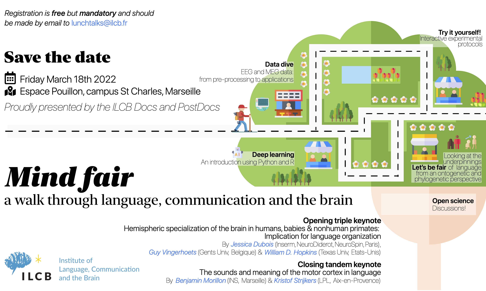

# Introduction to deep learning in Python and R 

## Abstract

...

## External resources

Link to slides...
Link to R notebook...
Link to Python notebook...

## Fundings

This work, carried out within the Institut Convergence ILCB (ANR-16-CONV-0002), has benefited from support from the French government, managed by the French National Agency for Research (ANR) and the Excellence Initiative of Aix-Marseille University (A*MIDEX).

## Copyright

...

